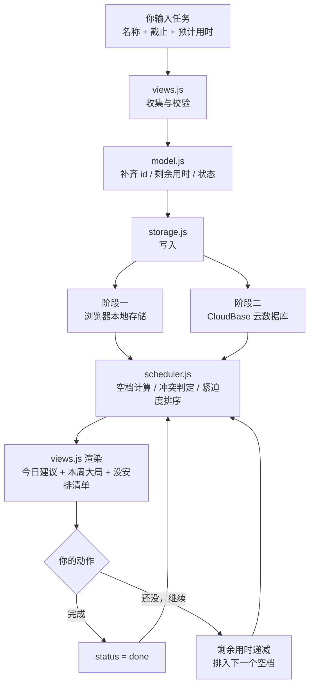

# NoMiss List · 技术设计（TECH_DESIGN.md）

> 文档：TECH_DESIGN.md ｜ 日期：2026-09-20 ｜ 阶段：Vibe Coding 五步工作流第 ③ 步「技术选型」
> 上游文档：PRD.md ｜ 下一步：Day 6 页面设计与原型

---

## 一、技术路线（结论先行）

> **默认路线：前端用原生 HTML / CSS / JavaScript 直连云数据库（CloudBase），网页托管在 GitHub Pages；分两阶段实现——阶段一用浏览器本地存储跑通全流程，阶段二接入云数据库实现「手机与电脑同步」。**

**为什么是这条线（三句话版）**：

1. **不写后端服务**：云平台提供的 SDK 可以让前端直接读写数据库，省掉"云函数"这一整层
2. **不选示范路线的三层架构**：云函数的价值是"验身份、守规则、同时服务多人"，本产品一个都不需要
3. **分两阶段落地**：先让你看到能用的网页，再谈注册云平台——基础设施跟着需求走，不提前压在你身上

---

## 二、三套候选路线对比

| | **路线 1：纯本地** | **路线 2：云数据库直连**（**默认路线**） | **路线 3：完整三层**（课程示范路线） |
|---|---|---|---|
| **前端** | 原生 HTML + CSS + JS | 原生 HTML + CSS + JS | React + Vite |
| **后端** | 无 | **无**（用云平台 SDK 直连） | CloudBase Node.js 云函数 |
| **数据库** | 浏览器本地存储 | CloudBase 云数据库 | CloudBase PostgreSQL |
| **部署** | GitHub Pages | GitHub Pages + 云平台跨域配置 | CloudBase 静态托管 |
| **多设备同步** | ❌ 不能 | ✅ 能 | ✅ 能 |
| **数据可靠性** | ⚠️ 清缓存可能丢 | ✅ 云端有备份 | ✅ 云端有备份 |
| **优点** | 零安装、零配置、改完刷新即见 | 用最小代价获得同步与持久；**不写后端代码** | 最规范、可扩展、多人协作友好 |
| **缺点** | 不同步、有丢数据风险 | 需注册云平台、配权限规则 | 概念最多（构建工具、组件化、云函数、SQL、部署链），零基础 28 天风险最高 |
| **28 天可行性** | 高 | 较高（分两步） | 偏低 |

### 取舍理由（为什么排除路线 3，哪怕它是示范路线）

| 云函数提供的价值 | 本产品是否需要 | 说明 |
|---|---|---|
| 验证用户身份 | ❌ 不需要 | 数据只给自己看，不做多人协作 |
| 执行业务规则与数据校验 | ⚠️ 前端可完成 | 本产品的"规则"只是时间计算，纯算术 |
| 同时服务大量用户 | ❌ 不需要 | 一个人用 |
| 隐藏密钥、代理第三方接口 | ❌ 暂不需要 | 本阶段不接第三方服务 |

**结论**：为「一个人的时间工具」套三层架构，等于为了防雨给自行车装车门。路线 3 的"看起来专业"换不来你要的"早点看到网页"。

### 为什么路线 2 要分两阶段

| 阶段 | 数据存哪 | 目标 | 触发条件 |
|---|---|---|---|
| **阶段一** | 浏览器本地存储 | 4 个视图与核心逻辑全部跑通，能看到、能点、能用 | Day 7 起 |
| **阶段二** | CloudBase 云数据库 | 手机与电脑同步、数据不丢 | **你注册云平台之后** |

**关键**：分两阶段**不是**先做路线 1 之后推倒重写。代码从一开始就按「存储层抽象」组织——所有地方只说"读数据 / 写数据"，具体存哪儿由存储层一个文件决定。阶段二是**替换一个零件**，不是重做。

---

## 三、技术栈清单

| 层 | 用什么 | 用途 | 为什么选它 |
|---|---|---|---|
| 页面结构 | HTML | 4 个视图的骨架 | 零基础最直观 |
| 样式 | CSS（手写，单文件） | 全部视觉 | 不需要框架与预处理器 |
| 交互逻辑 | 原生 JavaScript（ES6+） | 事件、渲染、计算 | 不引入构建工具，改完刷新即见 |
| 构建工具 | **无** | — | 没有打包步骤，少学一样东西、少一处故障点 |
| 存储（阶段一） | 浏览器本地存储 | 存任务 / 课表 / 设置 | 免费、离线可用、零配置 |
| 存储（阶段二） | CloudBase 云数据库 | 同上，且跨设备同步 | 前端可直连，无需自建后端 |
| 托管 | GitHub Pages | 把网页挂到公网 | 仓库已在 GitHub，零额外成本 |
| 版本管理 | Git + GitHub | 代码历史与备份 | 已在用（Day 2 起） |

**明确不引入**：React、Vue、Vite、Webpack、TypeScript、UI 组件库、CSS 框架、图表库。

---

## 四、项目结构

```
NoMiss-List/
├── index.html               入口：4 个视图的骨架 + 引入脚本
├── styles/
│   └── main.css             全部样式（含手机宽度适配）
├── scripts/
│   ├── storage.js           ★ 存储层：阶段一只管本地存储，阶段二换成云
│   ├── model.js             数据模型：任务 / 课表 / 设置的增删改查
│   ├── scheduler.js         计算层：空档计算、冲突判定、紧迫度排序、今日建议
│   ├── views.js             表现层：4 个视图的渲染与交互绑定
│   └── main.js              入口：初始化、默认值、事件总绑定
├── docs/
│   ├── research.md          需求研究（Day 3）
│   └── PRD.md               产品需求文档（Day 4）
├── TECH_DESIGN.md           本文档（Day 5）
├── AGENTS.md                项目协作规则（Day 1）
└── .gitignore               忽略规则（Day 2）
```

**分层原则**：`storage.js` 是唯一碰"数据存在哪"的文件。其余文件只调它的函数，**永远不直接读本地存储或数据库**。这是阶段二能"只改一处"的前提。

> 注：仓库根目录现有 `research.md`、`PRD.md` 位于根目录；是否移入 `docs/` 属于整理动作，**不在今日范围**，留待确认。

---

## 五、数据模型

### 5.1 任务 Task

| 字段 | 类型 | 必填 | 说明 |
|---|---|---|---|
| `id` | string | 是 | 唯一编号，如 `t_1726732800` |
| `title` | string | 是 | 任务名 |
| `dueAt` | string(ISO) | 否 | 截止时间 |
| `estimateMinutes` | number | 否 | 预计用时（分钟），默认取设置项 |
| `remainingMinutes` | number | 是 | 剩余用时；创建时等于 `estimateMinutes`，分段推进后递减 |
| `scheduledSegments` | array | 否 | 已排定时段 `[{ start, end }]`，支持一个任务跨多个空档 |
| `status` | enum | 是 | `todo` / `done` / `needsReschedule` |
| `createdAt` | string(ISO) | 是 | 创建时间 |
| `completedAt` | string(ISO) | 否 | 完成时间 |

### 5.2 固定占用 Block（课表）

| 字段 | 类型 | 必填 | 说明 |
|---|---|---|---|
| `id` | string | 是 | 唯一编号，如 `b_01` |
| `title` | string | 是 | 课程 / 事项名 |
| `weekday` | number | 是 | 星期几（1–7） |
| `startTime` | string(HH:mm) | 是 | 开始时间 |
| `endTime` | string(HH:mm) | 是 | 结束时间 |

### 5.3 设置 Settings

| 字段 | 类型 | 默认 | 说明 |
|---|---|---|---|
| `dayStart` | string(HH:mm) | `08:00` | 每天可用时间起点 |
| `dayEnd` | string(HH:mm) | `22:00` | 每天可用时间终点 |
| `defaultEstimate` | number | `30` | 新任务默认预计用时（分钟） |

### 5.4 存储位置对照

| 阶段 | 存储介质 | 键名 / 集合 |
|---|---|---|
| 阶段一 | 浏览器本地存储 | `nomiss.tasks`、`nomiss.blocks`、`nomiss.settings` |
| 阶段二 | CloudBase 云数据库 | 集合 `tasks`、`blocks`、`settings`（字段与上表一致） |

**时间格式约定**：所有时刻统一存 **ISO 8601 字符串**（如 `2026-09-19T16:00:00+08:00`），避免时区造成错算。日期显示格式只在前端渲染时转换。

---

## 六、接口列表

> 阶段一没有 HTTP 接口，只有**前端内部的分层接口**；阶段二由云平台 SDK 提供数据接口，业务接口保持一致。

### 6.1 存储层接口（`storage.js`，阶段一实现）

| 接口 | 作用 | 返回 |
|---|---|---|
| `readTasks()` | 读出全部任务 | Task[] |
| `writeTasks(list)` | 覆盖写入任务列表 | void |
| `addTask(task)` | 新增一条任务 | Task |
| `updateTask(id, patch)` | 按编号局部更新 | Task |
| `deleteTask(id)` | 按编号删除 | void |
| `readBlocks()` / `writeBlocks(list)` | 读写固定占用 | Block[] |
| `addBlock(b)` / `updateBlock(id,patch)` / `deleteBlock(id)` | 增改删固定占用 | — |
| `readSettings()` / `writeSettings(patch)` | 读写设置 | Settings |
| `exportAll()` / `importAll(json)` | 导出 / 导入全部数据（备份与迁移用） | JSON 字符串 |

### 6.2 计算层接口（`scheduler.js`）

| 接口 | 作用 | 返回 |
|---|---|---|
| `getFreeSlots(date, now)` | 算出某日**当前时刻之后**的空档 | `[{start, end, minutes}]` |
| `getOccupiedMinutes(date)` | 某日已占用总时长（课表 + 已排任务） | number |
| `getLoadRatio(date)` | 负荷比例 = 已占用 ÷ 当日可用时长（≥ 80% 视为过载） | number |
| `detectConflicts(days)` | 两两比对，返回所有重叠时段 | `[{segA, segB, overlapStart, overlapEnd}]` |
| `rankTasks(now)` | 按紧迫度排序：`(dueAt − now) ÷ remainingMinutes`，逾期为负 | Task[] |
| `getTodayAdvice(now)` | 返回唯一一条建议（含理由与分段提示） | Advice \| null |
| `predictNextAvailable(task, from)` | 放不下时给出最早可行时间 | `{date, slot}` \| null |

### 6.3 云端数据接口（阶段二预留，由云平台 SDK 提供）

| 操作 | 对应集合 | 说明 |
|---|---|---|
| 查询本人全部任务 | `tasks` | 按 `createdAt` 排序 |
| 新增 / 更新 / 删除任务 | `tasks` | 单条操作 |
| 读写课表与设置 | `blocks` / `settings` | 同上 |

**安全规则**：集合权限设为"仅创建者可读写"；用户身份由**云平台匿名登录**提供——**不使用任何自持密钥**（见第九节）。

---

## 七、前后端数据流

### 7.1 数据流图（文字版）

```
【写入流】添加一个任务

  你输入：任务名 + 截止时间 + 预计用时
        ↓
  前端界面（views.js）收集并做基础校验
        ↓
  数据模型（model.js）补齐字段：id / remainingMinutes / status / createdAt
        ↓
  存储层（storage.js）addTask( )
        ↓
  ┌─────────────────────────┬──────────────────────────┐
  │ 阶段一：浏览器本地存储   │ 阶段二：CloudBase 云数据库 │
  └─────────────────────────┴──────────────────────────┘
        ↓
  重新渲染：任务出现在对应日期；若与既有事项冲突，该时段被圈出


【读取流】打开首页，看到「今天该做什么」

  读取数据（storage.js）→ 任务列表 + 课表 + 设置
        ↓
  计算层（scheduler.js）：
     1. 算今天【当前时刻之后】的空档
     2. 两两比对，找冲突时段
     3. 按紧迫度 =（截止时间 − 现在）÷ 剩余用时 排序
     4. 取第一个放得下的任务 → 生成唯一一条建议（含理由）
        ↓
  表现层（views.js）渲染三块：
     ① 今天的建议   ② 本周大局（7 天负荷 + 冲突圈出）   ③ 没安排清单
        ↓
  你点「完成」或「还没，继续」
        ↓
  回到写入流：更新任务状态 / 剩余用时 → 建议自动刷新为下一条或下一段
```

### 7.2 数据流图（Mermaid 版，GitHub 上可直接渲染）



### 7.3 一句话总结数据流向

> **数据从你在界面上输入的三个字段出发，经前端补齐后交给存储层落盘（本地或云端），再由计算层读出来算空档、判冲突、排紧迫度，最后渲染成「现在该做什么」显示给你。**

### 7.4 数据的两个层次：原始数据与衍生数据（Day 5 每日一问 · 本人回答）

**问题**：用一句话说清你的数据从哪来、到哪去。

**本人回答（原话，未作改写）**：

> 「我认为数据一部分是用户给的原始数据，任务，时间，用时等，但是系统本身在运行的时候也会产生数据，会帮你分析出最优解，这也是数据的整合产出。」

**这段回答说对了一件关键的事（整理，非原话）**：

数据不是一类，是**两类**——

| 类别 | 是什么 | 本系统里有哪些 | 要不要存起来 |
|---|---|---|---|
| **原始数据** | 你亲手给的，系统造不出来 | 任务（名称 / 截止 / 预计用时）、课表（星期几 / 起止 / 名称）、设置（可用时间 / 默认用时）、任务状态与已排时段 | ✅ **必须持久化** |
| **衍生数据** | 系统算出来的，只要有原始数据就能重算 | 空档、冲突时段、负荷比例、紧迫度排序、今日建议 | ❌ **不持久化，每次重算** |

**由此确立的一条设计原则**：

> **只持久化原始数据，衍生数据每次重新计算。**

**为什么这样做**（三个好处）：

1. **不会自相矛盾**：如果建议被存起来，你改了任务时间却没更新建议，界面就会说谎；每次重算则永远一致
2. **存储更小、迁移更简单**：换设备、接云端时只需搬运原始数据
3. **规则可以随便升级**：改进紧迫度算法后，历史数据自动按新规则重算，不需要数据清洗

**唯一的例外**：`remainingMinutes`（剩余用时）虽然也是派生量（= 预计用时 − 已完成的段），但它**必须持久化**——因为你"做了多少"是系统推不出来的事实，只能靠你每次点击记录下来。

**这一条对写代码的直接影响**：`scheduler.js` 里所有函数都必须是**纯计算**（给同样的输入，得出同样的输出，不写存储），这也是第七节把计算层与存储层分开的根本原因。

---

## 八、错误处理

### 8.1 处理清单

| # | 出错场景 | 表现 | 处理方式 |
|---|---|---|---|
| 1 | 本地存储写入失败（隐私模式 / 配额满） | 保存没反应 | 捕获异常，明确提示"这次没存上"，并建议导出备份；**不静默失败** |
| 2 | 本地数据损坏（JSON 解析失败） | 打开是空白 | 不使用损坏数据、**不自动清空**；提示"数据读取出错"并提供导出原始内容 |
| 3 | 课表时间非法（结束 ≤ 开始） | 无法保存 | 拒绝保存，指出具体哪一项不对 |
| 4 | 截止时间早于当前时间 | 刚加就"逾期" | 允许保存（用户可能有此需要），并直接进入待重新安排逻辑 |
| 5 | 今天完全没有空档 | 建议区空白 | 显示状态文字 + 给出最早可行时间（对应 PRD 5.5） |
| 6 | 任务放不进任何空档 | 无法建议 | 明确提示"今天排不下"，给出最早可行日期（对应 PRD 5.5） |
| 7 | 空档计算结果为负 | 显示异常 | 结果下限截为 0，不显示负数 |
| 8 | 阶段二：网络断开 | 云端读写失败 | 降级到本地可用 + 提示"暂未同步，恢复网络后自动重试"；不丢本地改动 |
| 9 | 阶段二：云平台权限被拒 | 读不到数据 | 提示"登录状态可能已过期"，给出重新登录入口 |
| 10 | 用户输入超长任务名 | 排版破掉 | 界面层截断显示，原文完整保留 |

### 8.2 文案原则（与产品立场一致）

**错误提示不说"你错了"，只说两件事：发生了什么 + 你能做什么。**

| ❌ 不这样写 | ✅ 这样写 |
|---|---|
| 「输入格式错误！」 | 「结束时间要比开始时间晚，改一下就能存」 |
| 「保存失败，请重试」 | 「这次没能存上——可能是浏览器不允许存储，可以先用『导出备份』保住数据」 |
| 「数据读取异常，已重置」 | 「旧数据读取出错，我没有动它。你可以导出原始内容发给我看看」 |

---

## 九、环境变量与密钥

### 9.1 阶段一（当前）

**不需要任何环境变量，不需要任何密钥。** 纯前端、纯本地，没有秘密可言。

### 9.2 阶段二（接云数据库时）

| 项 | 能否写进前端代码 | 原因 |
|---|---|---|
| 云环境 ID（env id） | ✅ 可以 | 它只是"哪个环境"的标识，本身不敏感 |
| 数据库地址 / 集合名 | ✅ 可以 | 公开信息 |
| **任何形式的密钥 / AccessKey / Secret** | ❌ **绝对不可以** | **前端代码是公开的**（GitHub Pages 上人人可看），写进去等于把钥匙贴在门上 |
| 第三方服务 Token | ❌ 不可以 | 同上 |

**那怎么证明"这是我"？** —— 用云平台提供的**匿名登录 + 集合安全规则**（"仅创建者可读写"），让平台来保证"每个人只能碰自己的数据"，而不是靠一把你保管的密码。

### 9.3 `.env` 规则（Day 2 已建好防线，此处明确用法）

| 文件 | 是否入库 | 说明 |
|---|---|---|
| `.env` | ❌ 不入库 | 已被 `.gitignore` 忽略；存放本地开发用的敏感值 |
| `.env.example` | ✅ 可入库 | **只写字段名、不写真实值**，让别人知道需要配哪些项 |
| 任何含密钥的代码 | ❌ 不入库 | — |

**提交前自检**（写进习惯）：搜一遍代码里有没有 `key`、`secret`、`token`、`password`、`AKID` 这类字样。

---

## 十、迁移注意事项（本地存储 → 云数据库）

| # | 注意点 | 说明与对策 |
|---|---|---|
| 1 | **改动点集中在存储层** | 只改 `storage.js` 内部实现，函数签名保持不变；其余文件零改动 |
| 2 | **一次性数据搬家** | 首次接入云时，本地已有数据需要决定去向。对策：首次接入时明确询问用户——"把本地数据上传到云端" 或 "以云端为准"，**不擅自决定**（对应产品原则 P-A） |
| 3 | **导出 / 导入要有** | `exportAll()` / `importAll()` 在阶段一就实现，它既是备份手段，也是迁移通道 |
| 4 | **时间格式统一** | 全程用 ISO 字符串；跨时区或换设备时不会错算 |
| 5 | **键名 / 字段名保持一致** | 本地键名与云端集合名一一对应，减少映射代码 |
| 6 | **身份问题** | 阶段一没有"用户"概念；阶段二用匿名登录自动获得身份，**不需要用户注册账号**（对产品体验无损） |
| 7 | **离线策略** | 阶段二断网时以本地为准，恢复后同步；不做复杂的双向冲突合并（那属于路线 4，本期不做） |
| 8 | **同步范围** | 只同步任务、课表、设置三类数据，不做文件附件 |

---

## 十一、PRD 需要同步修订的地方（待办，今日不动 PRD）

> 依据今日清单「不做回头大改 PRD」，以下只登记、不修改。建议在 Day 6 或之后的清单里一并处理。

| # | PRD 中的原文 | 需要改成 | 原因 |
|---|---|---|---|
| 1 | 三节「本期不追求：多设备同步」 | 改为"本期追求：手机与电脑同步" | 用户已明确同步是硬需求 |
| 2 | 六节 F6「不发送任何网络请求」 | 拆为两个阶段：阶段一完全本地；阶段二仅与云数据库通信 | 两阶段策略 |
| 3 | 五节「不做账号注册 / 登录」 | 补充说明：采用云平台匿名登录，**用户本人不需要注册账号** | 措辞需澄清，避免与"接云"看起来矛盾 |
| 4 | 六节的 4 个"页面" | 落地为单文件内的 4 个视图（或确认改为 4 个独立 HTML 文件） | 实现方式需在 Day 6 设计阶段确认 |
| 5 | 十节风险 5「清缓存即丢数据」 | 阶段二后此风险消除，需更新 | 架构变化带来的风险变化 |

---

## 十二、风险与待确认

| # | 风险 / 待确认 | 影响 | 计划 |
|---|---|---|---|
| 1 | 云平台注册需要**实名认证**，可能卡住 | 阶段二长期无法启动 | 降级：停留在阶段一，用「导出备份」兜底；不因此停下整个项目 |
| 2 | 单文件多视图 vs 多个 HTML 文件 | 影响代码组织与教学清晰度 | Day 6 设计阶段确认 |
| 3 | 手机宽度下的可用性未验证 | 一周视图可能挤成一团 | Day 6 优先在手机宽度下验证 |
| 4 | 浏览器隐私模式下本地存储受限 | 无法保存 | 已列入第八节错误处理（场景 1） |
| 5 | 紧迫度公式依赖"预计用时"，用户可能乱填 | 建议质量下降 | 界面上轻提示可改，不强制；使用中观察 |
| 6 | 阶段二的同步冲突（两台设备同时改） | 可能出现数据覆盖 | 本期只做"最后写入为准"，不做双向合并 |
| 7 | 文档中 `docs/` 目录结构调整 | 可能造成路径引用混乱 | 属整理动作，需单独确认后再做 |

---

## 十三、下一步

| 时间 | 做什么 |
|---|---|
| Day 6 | 页面设计与原型（4 个视图的版面、手机宽度验证） |
| Day 7 起 | 按本设计写代码，优先 `storage.js` 与 `scheduler.js`；实现后逐条对照 PRD 第八节 57 条验收标准自测 |
| 你准备好之后 | 注册云平台 → 接入阶段二（同步与不丢数据） |
